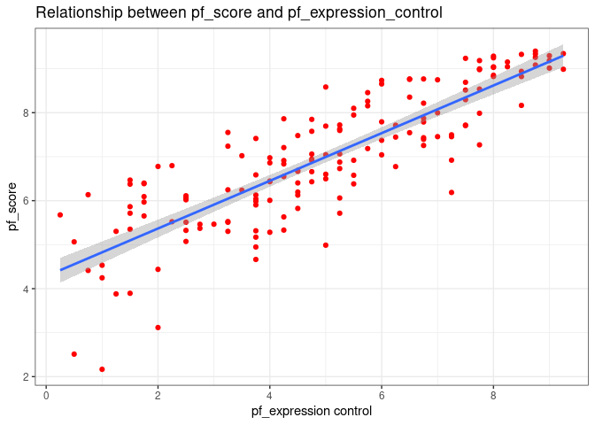
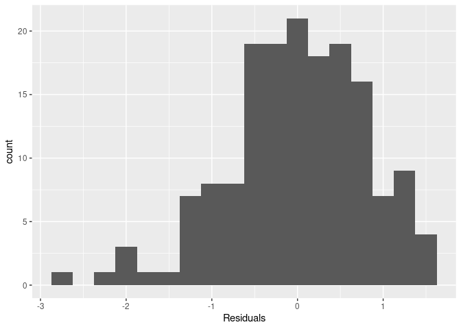

Activity 2
================
Narender

# Day1 - Activity2

## Task2 : Loading packages

``` r
library(tidyverse)
library(tidymodels)
```

## Task3 : Loading the data set

``` r
hfi<-readr::read_csv("https://www.openintro.org/data/csv/hfi.csv",show_col_types = FALSE)
```

**1) The hfi dataset has 1458 observations and 123 variables (1458 \*
123). Each row represents data of a country for that specific year**

## filtering the dataframe by year

``` r
hfi_2016 <- hfi %>% filter(hfi$year== 2016)

hfi_new<-hfi_2016 %>% select(pf_expression_control,pf_score)
```

**2) I would use a scatter plot to visualize the relationship between
pf\_score and pf\_expression\_control**

## Plot

``` r
plot1<-hfi_2016 %>% ggplot(aes(x=pf_expression_control,y=pf_score))+
  geom_point(color="red")+
  geom_smooth(method = lm)+
  scale_x_continuous(breaks = c(0,2,4,6,8))+
  scale_y_continuous(breaks = c(0,2,4,6,8))+
  labs(title= "Relationship between pf_score and pf_expression_control",
       x="pf_expression control",
       y="pf_score")+
  theme_bw()


plot1
```

    ## `geom_smooth()` using formula 'y ~ x'

<!-- -->

**3) The relationship looks linear and we can predict the pf\_score
using this linear model when given the pf\_expression\_control**

## Task4 : Sum of Squared residuals

**4) The smallest sum of square that I have got was 104.954 when
compared to other sum of squares (106.075, 112.042, 106.772, 108.213,
118.636) that I got while trying to minimize the sum of squared
residuals.**

## Task5 : Linear model

``` r
m1 <- lm(pf_score ~ pf_expression_control, data = hfi_2016)
tidy(m1)
```

    ## # A tibble: 2 × 5
    ##   term                  estimate std.error statistic  p.value
    ##   <chr>                    <dbl>     <dbl>     <dbl>    <dbl>
    ## 1 (Intercept)              4.28     0.149       28.8 4.23e-65
    ## 2 pf_expression_control    0.542    0.0271      20.0 2.31e-45

**5) The Y-intercept from the equation was 4.28**

**6) The slope from the equation was 0.542**

# Day2 - Activity2

## Task2: Overall model fit

``` r
# Correlation coefficient between pf_expression_control and pf_score

cor_coeff <-cor(hfi_2016$pf_expression_control,hfi_2016$pf_score,use ="everything",method = c("pearson","kendall","spearman"))

cor_coeff
```

    ## [1] 0.8450646

**1) The correlation coefficient for this model means how related the
pf\_expression\_control and pf\_score are. The correlation coefficient
is 0.845**

``` r
glance(m1)
```

    ## # A tibble: 1 × 12
    ##   r.squared adj.r.squa…¹ sigma stati…²  p.value    df logLik   AIC   BIC devia…³
    ##       <dbl>        <dbl> <dbl>   <dbl>    <dbl> <dbl>  <dbl> <dbl> <dbl>   <dbl>
    ## 1     0.714        0.712 0.799    400. 2.31e-45     1  -193.  391.  400.    102.
    ## # … with 2 more variables: df.residual <int>, nobs <int>, and abbreviated
    ## #   variable names ¹​adj.r.squared, ²​statistic, ³​deviance

**2) The value of R-square for this model is 0.714** **3) It explains
the proportion of variation in pf\_score explained by
pf\_expression\_control**

``` r
m2 <- lm(hf_score ~ pf_expression_control, data = hfi_2016)
tidy(m2)
```

    ## # A tibble: 2 × 5
    ##   term                  estimate std.error statistic  p.value
    ##   <chr>                    <dbl>     <dbl>     <dbl>    <dbl>
    ## 1 (Intercept)              5.05     0.123       41.1 5.97e-87
    ## 2 pf_expression_control    0.368    0.0224      16.5 2.73e-36

**4) The Regression line equation was y = 5.05 + 0.37 \*
pf\_expression\_control.**

**5) For every 1 unit increase in pf\_expression\_control, we expect a
country’s mean human freedom score to increase 0.368 units.**

## Task3 : Prediction and prediction errors

``` r
plot1
```

    ## `geom_smooth()` using formula 'y ~ x'

<!-- -->

**6) we can use the regression line equation to find the personal
freedom score which will be 5.906 for a pf\_expression\_control rating
of 3**

**7) This is an overestimate by 0.44**

## Task 4: Model diagnostics

``` r
m1_aug <- augment(m1)
```

``` r
ggplot(data = m1_aug, aes(x = .fitted, y = .resid)) +
  geom_point() +
  geom_hline(yintercept = 0, linetype = "dashed", color = "red") +
  xlab("Fitted values") +
  ylab("Residuals")
```

<!-- -->

**8) The points around the red horizantal line are randomly scattered.
Since the points show no pattern, we can say that the linear model is
correct.**

``` r
ggplot(data = m1_aug, aes(x = .resid)) +
  geom_histogram(binwidth = 0.25) +
  xlab("Residuals")
```

<!-- -->

**9) By the histogram above we can say that the data voilated the
nearly-normal condition, because the histogram is skewed rather than
being approximately normal**

**10)Based on the residuals vs fitted plot we can say that the constant
variance assumption is not violated because the residuals are scattered
with no particular pattern and exhibiting roughly constant variance at
each level of fitted values.**
